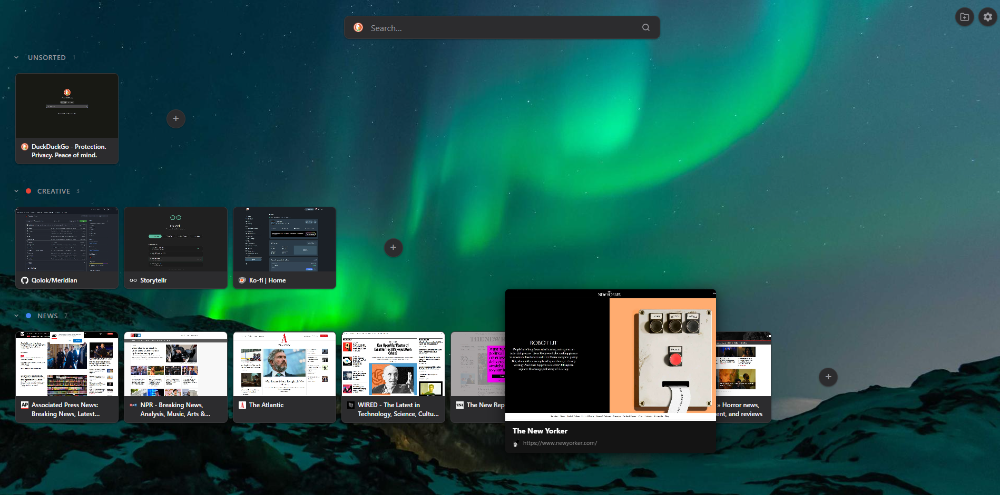

# Meridian

**Spatial tab command center** — a Chrome extension that replaces your new-tab page with a visual tab manager.

---

## Features

### Tab Cards & Workspace Lanes
Tabs are displayed as live thumbnail cards, organized into **workspace lanes** that map to Chrome tab groups or Meridian custom groups. Lanes are collapsible and support drag-and-drop tab reordering within and across groups.

### Lightbox Preview
Hover a tab card for 2 seconds to open a full-size preview lightbox showing the tab's thumbnail, title, and URL. Click to navigate to the tab, or press `Esc` to dismiss.

### Search Bar
A multi-engine search bar sits at the top of every new-tab page. Switch between **Google**, **DuckDuckGo**, **Bing**, and **Brave** with a single click on the engine logo. Your preference is saved across sessions.

### Theming
Choose **Light**, **Dark**, or **System** (follows OS preference). The selected theme is synced via `chrome.storage.sync`.

### Background Customization
Pick from:
- **Solid colors** — Black, Ink, Midnight, Forest, Plum
- **Gradient presets** — Midnight, Ocean, Dusk, Emerald, Amber, Bloom
- **Photos** — 12 curated images from Picsum (refresh for a new set)
- **Custom image** — upload any image from your device

### Tab Organization
Enable **Group unsorted tabs by domain** to automatically cluster ungrouped tabs by site, reducing visual noise.

### New Tab Behavior
Configure what happens when you open a new tab:
- Open a new Meridian view
- Always return to a pinned Meridian tab
- Open a custom homepage URL

### Thumbnails
Trigger a full thumbnail refresh from settings. The background service worker captures tab screenshots via `captureVisibleTab`.

### Keyboard Navigation

| Key | Action |
|---|---|
| `Ctrl+Shift+M` | Focus your Meridian tab from anywhere in Chrome |
| `←` / `→` | Move between tabs within the current group |
| `↑` / `↓` | Move between groups (lanes) |
| `/` | Focus the search bar |
| `N` | Create a new group |
| `Esc` | Close lightbox / settings / blur search |

---

## Installation

Meridian is a local extension with no build step required.

1. Download the [latest release](https://github.com/Qolok/Meridian/releases).
2. Open Chrome and navigate to `chrome://extensions`.
3. Enable **Developer mode** (toggle in the top-right corner).
4. Click **Load unpacked** and select the repository folder.
5. Open a new tab — Meridian is live.

---

## Tech Stack

- **Vanilla JS** (ES modules, no framework, no build step)
- **Plain CSS** with CSS custom properties for theming
- **Chrome Extensions Manifest V3**

### Key Files

| File | Purpose |
|---|---|
| `meridian.html` / `meridian.js` | Entry point; main render loop, event wiring, lightbox, theme/background |
| `background.js` | Service worker; captures tab thumbnails |
| `meridian.css` | All styles; `html[data-theme]` for theming, `--bg-image` for backgrounds |
| `components/TabCard.js` | Individual tab card with thumbnail and lightbox hover timer |
| `components/WorkspaceLane.js` | Collapsible lane with drag-and-drop tab grid |
| `components/SearchBar.js` | Multi-engine search bar |
| `components/SettingsPanel.js` | Settings UI (behavior, theme, background, thumbnails) |
| `components/ContextMenu.js` | Right-click context menu |
| `utils/thumbnailCache.js` | Thumbnail storage and retrieval |
| `utils/workspaceManager.js` | Group and lane state management |
| `utils/domainCluster.js` | Domain-based tab clustering logic |

---

## Permissions

| Permission | Why |
|---|---|
| `tabs` | Read tab info and navigate |
| `tabGroups` | Read and manage Chrome tab groups |
| `storage` | Persist settings across sessions |
| `scripting` | Inject scripts for thumbnail capture |
| `host_permissions: <all_urls>` | Capture screenshots of any tab |
